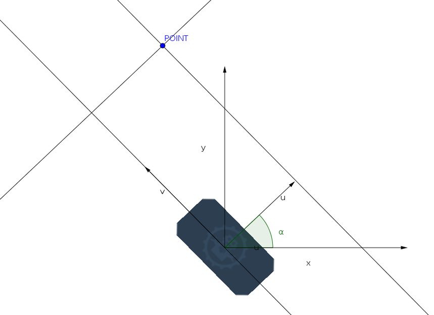

# Abstract Move Strategy

Cette page a pour vocation de presenter le fonctionnement des AbstractMoveStrategy mise en place sur la base roulante. Avant de commencer, il faut bien comprendre que le rôle d’une AbstractMoveStrategy est de générer en temps reel des consignes de vitesses pour les moteurs, afin de pouvoir diriger le robot vers la position souhaitée. Pour atteindre cette mission, l’AbstractMoveStrategy dispose en temps réel de la position du robot. Le but pour créer une AbstractMoveStrategy est définir des algorithmes les plus simples possible pour définir des vitesses associées.

## TurnOnTheSpot

TurnOnTheSpot a pour but de faire tourner le robot sur place. Cela n’a l’air de rien mais si on se contente de mettre une simple vitesse angulaire, le robot va naturement diverger de sa position initiale. Cela est dû aux imperfections du robot et ne peux pas être corigé par un simple asservissement en vitesse linéaire à 0.

Pour résoudre le problème, TurnOnTheSpot utilise un algorithme simple. Le principe de cet algorithme est de determiner à partir de l’angle courant la vitesse linéaire grâce à un changement de base et la vitesse angulaire avec un asservissement proportionnel. Pour determiner la vitesse angulaire, TurnOnTheSpot prend la différence entre l’angle courant et l’angle souhaité puis la multiplie par un coefficient proportionnel. Le calcul de la vitesse linéaire est un peu plus compliqué. Pour determiner cette vitesse, on calcule la distance entre le centre du robot et la projection du point de rotation sur l’axe des x du robot.

Voici un shéma représentant les deux bases :

On peux voir la base normale (x,y) et la base du robot (u,v).

La base du robot est déterminé à partir d’une rotation alpha (angle du robot) de la base (x,y).
On peut donc facilement écrire :

`u = cos(alpha).x + sin(alpha).y`

`v = sin(alpha).x - cos(alpha).y`

La distance entre le centre du robot et la projection du centre de rotation sur l’axe u est égale à la composante u du vecteur robot -> point. Donc cette distance est égal à `cos(alpha).dx + sin(alpha).dy` avec `dx = x_point - x_robot` et `dy = y_point - y_robot`. On multiplie cette distance avec un coefficient proportionnel pour obtenir notre vitesse linéaire.

Voici un exemple de fonctionnement:

GIF

## PurePursuit

Purpursuit a pour but de suivre une trajectoire sous la forme de ligne brisée.

La trajectoire a la particularité de suivre cette ligne avec des trajectoires courbes en essayant de respecter au mieux la ligne consigne. Pour faire le calcul des vitesses cet algorithme est divisé en 4 sous algorithme.

Le principe de Purpursuit est de générer un point à faire suivre au robot. Ce point est situé devant la projection du robot sur la droite. La distance de ce point cible est apellé lookahead. Une fois le point calculé, on en déduit les vitesses pour le rejoindre. L’astuce réside dans le fait que ce point va avancer en même temps que le robot jusqu’à la fin de la ligne brisée.

GIF
